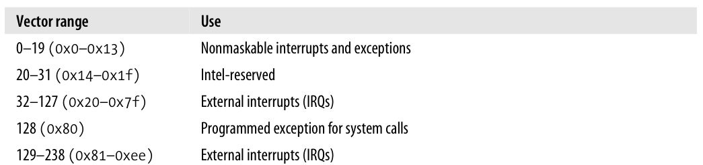

# Lab 02 - [Linux Shellcoding](https://0x00sec.org/t/linux-shellcoding-part-1-0/289)

## Simple Shellcode

Here we will be writing a simple assembly program that spawns a shell. To do this we need to install [nasm](https://www.nasm.us/) to be able to compile the assembly code we write. It can be installed using `sudo apt-get install nasm`.

Now we are ready to write an assembly program. In this program we will be using a syscall to spawn a bash shell.

To call the syscall we will be using an interrupt as it does not require the stack. To do this we can use the assembly code `int 0x80`. In linux, the interrupt `0x80` is used for system calls.

[](https://stackoverflow.com/a/28784822)

The interrupt can take arguments in the registers `eax`, `ebx`, `ecx`, `edx`, `esi`, and `edi`. The first argument is `eax`, should contain the syscall number. We can use this resource to identify which syscalls we can use: http://syscalls.kernelgrok.com/.

To spawn a shell, we will be using the `execve` syscall. This syscall is used to execute programs, so we can execute `/bin/sh` using the syscall to spawn a shell.

| Function | eax | ebx | ecx |
|--|:-:|--|--|
| [exit](http://man7.org/linux/man-pages/man2/exit.2.html) | `1` | `int error_code` (exit code) | - |
| [execve](http://man7.org/linux/man-pages/man2/execve.2.html) | `11` | `char *pathname` (path to executable) | `char *const argv[]` (arguments) |

Using this knowledge we can write the following assembly code.

```asm
section .data
  msg db '/bin/sh' ; db stands for define byte, msg will now be a string pointer.

section .text
  global _start   ; Needed for compiler, comparable to int main()

_start:
  mov eax, 11     ; eax = 11, think of it like this mov [destination], [source], 11 is execve
  mov ebx, msg    ; Load the string pointer into ebx
  mov ecx, 0      ; no arguments in exc
  int 0x80        ; syscall

  mov eax, 1      ; exit syscall
  mov ebx, 0      ; no errors
  int 0x80        ; syscall
```

This code is similar to the follwoing C code.

```c
main()
{
    execve("/bin/sh", 0);  // spawn shell
    exit(0);              // exit program
}
```

To run this assembly code, we must first compile it. To do this we must first generate the object file for the code using `nasm` and then compile the file using `ld`. We will be generating an `.elf` file from `nasm` as we are targeting Linux machines, and since the assembly code we wrote is for 32-bit machines, we must specify `ld` to compile it in 32-bit mode using the flag `-m elf_i386`.

```console
$ nasm -f elf -o shell.o shell.asm
$ ld -m elf_i386 -o shell.out shell.o
```

**Objdump**
```console
$ objdump -M intel -d shell
```

## Eliminating null bytes


## Running Shellcode

**Compiling test.c**

`test.c` needs to be compiled to target 32bit machines with stack protection turned off
```console
$ gcc shell_codetest.c -o shell_codetest.out -m32 -fno-stack-protector -z execstack -no-pie
```


---
https://0x00sec.org/t/linux-shellcoding-part-1-0/289
