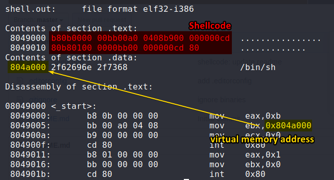
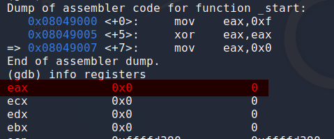
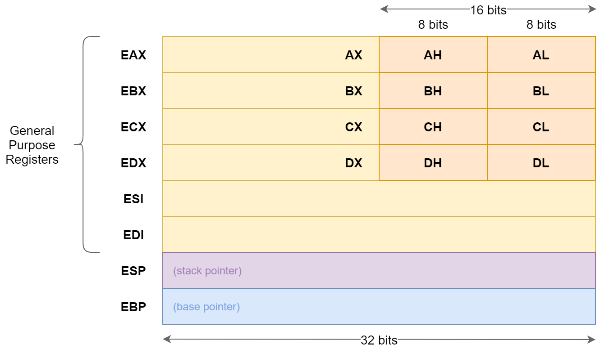

# [Linux Shellcoding](https://0x00sec.org/t/linux-shellcoding-part-1-0/289)

## Simple Shellcode

Here we will be writing a simple assembly program that spawns a shell. To do this we need to install [nasm](https://www.nasm.us/) to be able to compile the assembly code we write. It can be installed using `sudo apt-get install nasm`.

### Writing assembly code

Now we are ready to write an assembly program. In this program we will be using a syscall to spawn a bash shell.

To call the syscall we will be using an interrupt as it does not require the stack. To do this we can use the assembly code `int 0x80`. In linux, the interrupt `0x80` is used for system calls.

[](https://stackoverflow.com/a/28784822)

The interrupt can take arguments in the registers `eax`, `ebx`, `ecx`, `edx`, `esi`, and `edi`. The first argument is `eax`, should contain the syscall number. We can use this resource to identify which syscalls we can use: http://syscalls.kernelgrok.com/.

To spawn a shell, we will be using the `execve` syscall. This syscall is used to execute programs, so we can execute `/bin/sh` using the syscall to spawn a shell.

| Function | eax | ebx | ecx |
|--|:-:|--|--|
| [exit](http://man7.org/linux/man-pages/man2/exit.2.html) | `1` | `int error_code` (exit code) | - |
| [execve](http://man7.org/linux/man-pages/man2/execve.2.html) | `11` | `char *pathname` (path to executable) | `char *const argv[]` (arguments) |

Using this knowledge we can write the following assembly code.

```asm
section .data
  msg db '/bin/sh' ; db stands for define byte, msg will now be a string pointer.

section .text
  global _start   ; Needed for compiler, comparable to int main()

_start:
  mov eax, 11     ; eax = 11, think of it like this mov [destination], [source], 11 is execve
  mov ebx, msg    ; Load the string pointer into ebx
  mov ecx, 0      ; no arguments in exc
  int 0x80        ; syscall

  mov eax, 1      ; exit syscall
  mov ebx, 0      ; no errors
  int 0x80        ; syscall
```

This code is similar to the following C code.

```c
main()
{
    execve("/bin/sh", 0);  // spawn shell
    exit(0);               // exit program
}
```

### Running the code

To run this assembly code, we must first compile it. To do this we must first generate the object file for the code using `nasm` and then compile the file using `ld`. We will be generating an `.elf` file from `nasm` as we are targeting Linux machines, and since the assembly code we wrote is for 32-bit machines, we must specify `ld` to compile it in 32-bit mode using the flag `-m elf_i386`.

```console
$ nasm -f elf -o shell.o shell.asm
$ ld -m elf_i386 -o shell.out shell.o
```

After compiling, we can run the program using `./shell.out`.


We have now successfully gotten a shell.

### Get shellcode

Now we can try to convert program to shellcode. First lets analyze the output of `objdump` for the compiled binary

```console
$ objdump -M intel -s -d shell.out
```


This shows some sections. Let's take a look at what each section does:

* `.text` contains the program's actual code (the shell code)
* `.data` is where the string data is stored
* `<_start>` is the main program


We can now convert this shellcode into escaped C format which can be executed.

```c
"\xb8\x0b\x00\x00\x00\x00\xbb\xa0\x90\x04\x08\xb9\x00\x00\x00\x00\x00\xcd\x80\xb8\x01\x00\x00\x00\xbb\x00\x00\x00\x00\xcd\x80"
```

As we can see, the `.data` section is not included in the shellcode. This is because the string is allocated to a virtual address space which is determined when the program is done. This means that if we use the shellcode as is, the output string might be and empty or garbage value, and would cause the shellcode to fail.

In addition to this, we face another issue: **null bytes**.

### What are null bytes?
In C, strings are terminated using `\x00`, or a null byte. If a null byte is included in a string, it will ignore everything placed after it. We can test this using the following code.

```c
#include <stdio.h>
int main()
{
    printf("Hello\x00World");
    return 0;
}
```
Compiling and running this program produces the following output.
```console
$ gcc -o test_null_bytes.out test_null_bytes.c
$ ./test_null_bytes.out
Hello
```
As we can see, we used the string `Hello\x00World` in the program but the output only gives `Hello`. This will become an issue while executing shellcode as if there is a null byte, the execution of the shellcode will stop.


To fix this issue, we have to avoid using statements that result in `\x00` in our assembly code. This can be tricky as we need to use `0` in our code multiple times.

## Fixing Issues

### Addressing null bytes

#### Generating 0 using XOR

To overcome the limitations, we can try using the `XOR` instruction. The instruction can be used to generate 0's without explicit statement due to the way the XOR operation works.

| A | B | A `OR` B | A `XOR` B |
|:--:|:--:|:--:|:--:|
| 0 | 0 | 0 | 0 |
| 1 | 0 | 1 | 1 |
| 0 | 1 | 1 | 1 |
| 1 | 1 | 1 | 0 |

As we can see above, if a number is XOR'd with itself, the result is 0. This means that we can call the `xor` instruction with the same register as the parameters to set it to 0.


As we can see here if we `xor` `eax` with itself, we do not get 0's in the resulting shell code. We can analyze this further using `gdb`.


As we can see here, before the `xor` instruction is run, `eax` has a value of 15.

But after the `xor` instruction is run, the value of `eax` becomes 0.



We can now use `eax` instead of 0 in our code. But we still face a problem as we will need to assign values to `eax` to be able to run our syscall. To overcome this issue let's take a look at how `eax` is structured in memory.

#### Using lower half of registers

32-bit data registers such as `EAX`, `EBX`, `ECX`, and `EDX` can be used in 3 ways:
1. They can be used as complete 32 bit registers
2. The lower halves of the 32-bit registers can be used as four 16-bit registers: `AX`, `BX`, `CX`, and `DX`
3. Lower half of these 16-bit registers can be used as eight 8-bit registers: `AH`, `AL`, `BH`, `CH`, `CL`, `DH`, and `DL`.



The `AX` is the primary accumulator, and is used for most arithmetic instructions. Usually, values are stored in the `AX` or `AL` registers according to the size of the operand.

We can take advantage of this property to set values to `EAX` by assigning them to `AL`. Doing so will not result in null bytes in the shell code as seen below.


## Running the Shellcode

**Compiling test.c**

`test.c` needs to be compiled to target 32bit machines with stack protection turned off
```console
$ gcc test.c -o test.out -m32 -fno-stack-protector -z execstack -no-pie
```


---
https://0x00sec.org/t/linux-shellcoding-part-1-0/289
